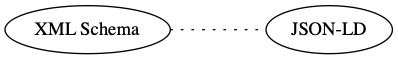
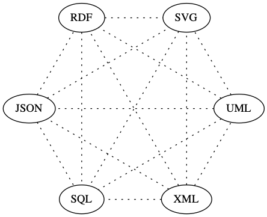
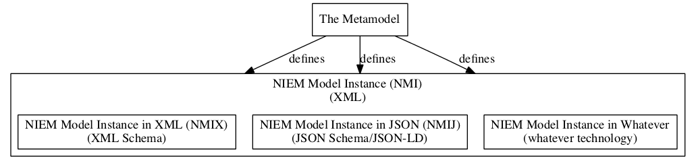

# Introduction to NIEM Model Instances

## Abstract

The "Metamodel" is a framework which expands the reach of NIEM into additional technologies beyond XML Schema. By separating modeling concepts from XML Schema, the Metamodel defines NIEM in a technology and platform independent format as a "NIEM Model Instance." This instance can then be transformed into specific technologies, negating the need to directly convert between disparate technologies and avoiding a resulting loss of functionality.

This technology and platform independent format will enable NIEM use in a variety of technologies, starting with XML Schema and JSON, and later RDF, UML, _et al_. It will enable platform independent tool suites with converters for other technologies. It frees NIEM from the limitations of XML Schema. It enables the community to transform NIEM into other needed technologies.

## Background: How We Got Here

NIEM began as a framework for building and defining messages to facilitate exchanges of information. One part of the framework was a defined process for these message. Another part of the framework was a model that formed the basis on which exchanges were defined. The base would be both carved down _and_ extended to meet the needs of each exchange. This base exists as a set of XML Schema documents.

Other means of exchanging information are increasingly being used. Demand for NIEM-conformant exchange mechanisms has expanded beyond XML Schema. Most notably, JSON<sup>[1](#json_fn)</sup> is the current alternate means desired, but many more exist.

Dealing with this issue, both now and in the future, is the rationale for the Metamodel.

## Problem/Issue

This introduces a problem. How do you transform the model from XML Schema into some form of JSON, when XML Schema and JSON have similar, but definitely different, feature sets? We have a specification and other guidance for this transformation, but the process isn't trivial and the results may not be satisfying.

The situation is shown below, the dotted line representing the incomplete transformation between these two technologies.



Still, the XML Schema to JSON transformation is manageable. As more technologies are added, the transformations become unwieldy. Looking forward, this becomes more problematic as the community does work in other technologies. How does work done in JSON get transformed into RDF<sup>[2](#rdf_fn)</sup>? How accurate is that transformation? Does that work get transformed into XML Schema first and _then_ into RDF, or directly into RDF?

The "N-squared" diagram is familiar to anyone who has seen many presentations about NIEM. Usually it's representing a variety of entities making an ever growing number peer-to-peer sharing agreements. The same diagram applies here, as a multitude of technologies start requiring peer-to-peer conversions between technologies.



At the message level, NIEM provides the means to define a single centralized and standardized format for the exchange, replacing the complexity of numerous peer-to-peer agreements. Everyone implements towards the standard instead of peer-to-peer agreements.

This same concept applies with models and technologies. There is one centralized and standardized "model instance" rather than individual transformations between technologies. Different technologies are transformed from the standard model. The lines are solid, as each transformation is better able to leverage the abilities of a particular technology.


## Going Forward

Currently, modeling concepts are embedded in a specific technology, XML Schema. We overload XML Schema concepts to include modeling concepts. We use XML Schema to both define NIEM _and_ act as the tool for validating actual messages.

The solution is to create the modeling concepts in a conceptual format instead of embedding them in XML Schema. Instead of implying modeling concepts in XML Schema, we explicitly define them in a separate model, called a Model Instance.

**This allows for _concept_-to-technology conversions, e.g. Model -> XML Schema and Model -> JSON. This is easier and more accurate than technology-to-technology conversions, e.g. XML Schema -> JSON.**

## How It Works

**The "Metamodel" is a framework for building models.** The metamodel itself isn't the NIEM model. It's a "neutral modeling formalism" for defining models. The metamodel provides the means to define a model, as compared to NIEM which is a means for defining real world objects:

- NIEM: Defines real world things
- Metamodel: Defines modeling concepts

The metamodel itself isn't the NIEM model.

## What It Looks Like

Here's a snippet from NIEM, a subset of `nc:PersonEmploymentAssociation` and its type `nc:EmploymentAssociationType`. It defines how a matching XML instance document needs to look, but modeling concepts are implied with terms like "element" and "complex type."

```xml
<xs:complexType name="EmploymentAssociationType">
	<xs:annotation>
		<xs:documentation>A data type for an association between an employee and
		  an employer.</xs:documentation>
	</xs:annotation>
	<xs:complexContent>
		<xs:extension base="nc:AssociationType">
			<xs:sequence>
				<xs:element ref="nc:Employee" minOccurs="0" maxOccurs="unbounded"/>
				<xs:element ref="nc:Employer" minOccurs="0" maxOccurs="unbounded"/>
			</xs:sequence>
		</xs:extension>
	</xs:complexContent>
</xs:complexType>

<xs:element name="PersonEmploymentAssociation" type="nc:EmploymentAssociationType" nillable="true">
	<xs:annotation>
		<xs:documentation>An association between an employee and
		  an employer.</xs:documentation>
	</xs:annotation>
</xs:element>
```

Below is the matching snippet from a NIEM Model Instance subset. While it's longer, that's because it details the different objects in modeling terms like "object property" and "class." Note that it isn't XML _Schema_. It's not designed as a tool for validating exchanges. It's plain XML and only defines the Model Instance. To use it as a tool for validation, you convert this to the technology you'll be using. That representation could be XML Schema, JSON, RDF, UML<sup>[3](#uml_fn)</sup>, or whatever meets your requirements.

```xml
<ObjectProperty structures:id="nc.PersonEmploymentAssociation">
	<Name>PersonEmploymentAssociation</Name>
	<Namespace structures:ref="nc" xsi:nil="true"/>
	<DefinitionText>An association between a person and employment
	  information.</DefinitionText>
	<Class structures:id="nc.PersonEmploymentAssociationType">
		<Name>PersonEmploymentAssociationType</Name>
		<Namespace structures:ref="nc" xsi:nil="true"/>
		<DefinitionText>A data type for an association between a person and an
		  employment.</DefinitionText>
		<ExtensionOf>
			<Class structures:ref="nc.AssociationType" xsi:nil="true"/>
			<HasObjectProperty mm:sequenceID="1" mm:minOccursQuantity="1"
			mm:maxOccursQuantity="1">
				<ObjectProperty structures:id="nc.Employer">
					<Name>Employer</Name>
					<Namespace structures:ref="nc" xsi:nil="true"/>
					<DefinitionText>A party/entity (organization or person) who
					  employs a person.</DefinitionText>
					<Class structures:ref="nc.EntityType" xsi:nil="true"/>
				</ObjectProperty>
			</HasObjectProperty>
			<HasObjectProperty mm:sequenceID="2" mm:minOccursQuantity="1"
				mm:maxOccursQuantity="1">
					<ObjectProperty structures:id="nc.Employee">
						<Name>Employee</Name>
						<Namespace structures:ref="nc" xsi:nil="true"/>
						<DefinitionText>A person who works for a business or a
						  person.</DefinitionText>
						<Class structures:ref="nc.PersonType" xsi:nil="true"/>
					</ObjectProperty>
			</HasObjectProperty>
		</ExtensionOf>
		<ContentStyleCode>HasObjectProperty</ContentStyleCode>
	</Class>
</ObjectProperty>
```

## Terminology

There are several levels to these concepts and past terminology hasn't clearly delineated them.

### Metamodel

The framework itself is the "Metamodel." It's an abstraction of what makes up a model. It's not NIEM-specific. We use it to define NIEM, but you could use it to define any number of other models. There is no "NIEM Metamodel" although the term is colloquially used to describe using the metamodel and NIEM together.

The Metamodel is a crucial tool for creating and maintaining models -- it is not typically something with which an ordinary NIEM user would be concerned.

### Model Instance

Generically speaking, when you create a model from the Metamodel, you get a "model instance." This is a conceptual model reflecting the objects and relationships in a subject area. This does _not_ have to be NIEM. The Metamodel could be used to create a wide variety of different Model Instances. Of course, our main interest is in NIEM so we want to create a Model Instance reflecting NIEM.

### NIEM Model Instance

When you create a specific model, that name for that model instance is given a prefix determined by what specific model you've created. If you create NIEM as a model, that's a "NIEM Model Instance (NMI)." This is still a conceptual model. To use it for validating real-world exchanges, it is instantiated into some format.

Up until this point, the Metamodel and Model Instances are mainly behind-the-scenes tools. **Community members eventually need platform agnostic versions of NIEM that can be used to define exchanges, that in turn can be implemented in many different technologies. The NIEM Model Instance is used to define an exchange, in terms of creating subsets and new content. It underlies the tooling. It is the platform _independent_, or agnostic, version of NIEM.**

To actually implement an exchange, platform _dependent_ versions are needed.

### NIEM Model Instance XML/JSON

Transforming the NIEM Model Instance into a representation in a particular technology adds the technology as a suffix. If a NIEM Model Instance is converted to XML Schema, it becomes a "NIEM Model Instance in XML (NMIX)". If converted to JSON Schema, it's a "NIEM Model Instance in JSON (NMIJ)."

A NIEM Model Instance in XML (NMIX) is currently what is termed "NIEM." **The NIEM Model Instance abstracts NIEM up a level, in order to separate the modeling concepts from the specific technology of XML Schema.**

XML and JSON aren't the only technologies for this conversion but are the starting points for the effort. The initial forms of NIEM Model Instances will be those two technologies.



While creating platform dependent versions of NIEM for validation purposes is a major outcome of the Metamodel and NIEM Model Instance, some instances may have entirely different purposes, often as a means of viewing a model.

## Benefits

The major benefit is enabling the use of multiple model instance formats and views from one "source." The NIEM Model Instance can be transformed into any of these example formats, once appropriate transformations are written:

- XML Schema
- JSON/JSON-LD<sup>[4](#json-ld_fn)</sup>
- SQL<sup>[5](#sql_fn)</sup>
- UML (via XMI<sup>[6](#xmi_fn)</sup>)
- RDF/OWL<sup>[7](#owl_fn)</sup>
- OpenAPI<sup>[8](#openapi_fn)</sup>
- Protobuf<sup>[9](#protobuf_fn)</sup>
- Human readable documentation
	- Text (HTML<sup>[10](#html_fn)</sup>, Markdown<sup>[11](#markdown_fn)</sup>, DOCX<sup>[12](#docx_fn)</sup>, RTF<sup>[13](#rtf_fn)</sup>, PDF<sup>[14](#pdf_fn)</sup>, CSV<sup>[15](#csv_fn)</sup>, etc.)
	- Diagrams (Graphviz/DOT<sup>[16](#dot_fn)</sup>)

**Using a NIEM Model Instance, you no longer need separate tool suites for each format, e.g. SSGT and Movement. There is one tool suite that deals with models, with converters for different technologies. Converters are easier to write than tool suites. Development of those converters can be spread out over the community, leveraging expertise in each technology.**

## Why Not Just Use RFD/RDFS<sup>[17](#rdfs_fn)</sup>?

NIEM models have details that aren't easily captured in RDF. Concepts like cardinality and field typing are crucial to information exchanges, yet are not easily represented in RDF.

**A key benefit of the Metamodel is that the NIEM Model Instance can be readily converted to RDF.**

## Why Not Just Use UML?

Prior efforts at defining NIEM in UML were complex and costly. While free and open source tools for using UML exist, those that explicitly supported NIEM were expensive and proprietary.

Additionally, UML tools use XMI as a format for exchanging diagrams, but implementation of XMI across tools and versions isn't as stable and reliable as needed.

**A key benefit of the Metamodel is that the NIEM Model Instance can be readily converted to UML/XMI.**

## Getting Started with the Metamodel

Development of the Metamodel and transformations is ongoing, along with accompanying documentation. Visit https://webb.github.io/niem-metamodel/ for further technical information.

___

- <a name="json_fn">1</a>. [JavaScript Object Notation (JSON)](https://en.wikipedia.org/wiki/JSON)
- <a name="rdf_fn">2</a>. [Resource Description Framework (RDF)](https://en.wikipedia.org/wiki/Resource_Description_Framework)
- <a name="uml_fn">3</a>. [Unified Modeling Language (UML)](https://en.wikipedia.org/wiki/Unified_Modeling_Language)
- <a name="json-ld_fn">4</a>. [JavaScript Object Notation for Linked Data (JSON-LD)](https://en.wikipedia.org/wiki/JSON-LD)
- <a name="sql_fn">5</a>. [Structured Query Language (SQL)](https://en.wikipedia.org/wiki/SQL)
- <a name="xmi_fn">6</a>. [XML Metadata Interchange (XMI)](https://en.wikipedia.org/wiki/XML_Metadata_Interchange)
- <a name="owl_fn">7</a>. [Web Ontology Language (OWL)](https://en.wikipedia.org/wiki/Web_Ontology_Language)
- <a name="openapi_fn">8</a>. [OpenAPI](https://en.wikipedia.org/wiki/OpenAPI_Specification)
- <a name="protobuf_fn">9</a>. [Protocol Buffer](https://en.wikipedia.org/wiki/Protocol_Buffers)
- <a name="html_fn">10</a>. [HyperText Markup Language (HTML)](https://en.wikipedia.org/wiki/HTML)
- <a name="markdown_fn">11</a>. [Markdown](https://en.wikipedia.org/wiki/Markdown)
- <a name="docx_fn">12</a>. [Office Open XML (DOCX)](https://en.wikipedia.org/wiki/Office_Open_XML)
- <a name="rtf_fn">13</a>. [Rich Text Format (RTF)](https://en.wikipedia.org/wiki/Rich_Text_Format)
- <a name="pdf_fn">14</a>. [Portable Document Format (PDF)](https://en.wikipedia.org/wiki/PDF)
- <a name="csv_fn">15</a>. [Comma-Separated Values (CSV)](https://en.wikipedia.org/wiki/Comma-separated_values)
- <a name="dot_fn">16</a>. [DOT (graph description language)](https://en.wikipedia.org/wiki/DOT_(graph_description_language))
- <a name="rdfs_fn">17</a>. [RDF Schema (Resource Description Framework Schema)](https://en.wikipedia.org/wiki/RDF_Schema)